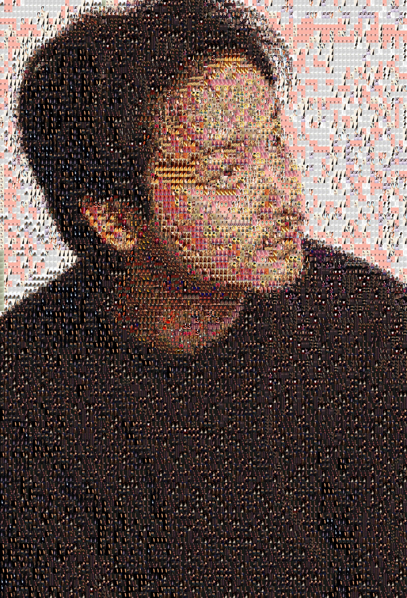

# mosaic-images

## 项目简介
千图成像，利用一张模版图，可以使用大量的图片合成这张模版图

## 安装要求
python3.6 +

## 安装

* git clone https://github.com/stars1324/mosaic-images.git

* pip install -r requirements.txt

* 将需要输入的图片改成 input.jpg
* 将需要合成的背景图放到bg目录下
  * spider为初步的例子，下载的为我的偶像张国荣的图片
    * 执行方式：python3 spider.py
* 执行 python main.py
* 如果自己有更换了bg的图片，则需要删掉data下面的所有文件，让他重新生成对象序列化

## web运行
python3 web/app.py
> 目前ui有待修改
> 代码有待优化，目前仅实现了现行流程（本作者非专业Python工程师）

修改背景图的精细度
> replace_num = 100 

## todo list
* 添加其他spider
* 制作Python包

## 效果展示
 

## 详解
详细讲解请查看掘金 [传送门](https://juejin.cn/post/7077933676197052452)